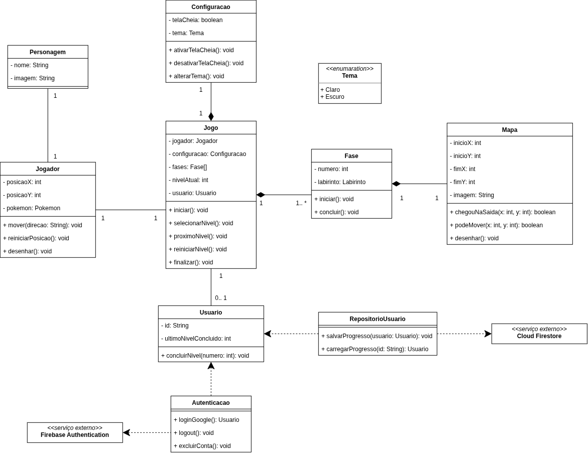

# 🎮 PokéRota Lógica

## 🏷️ Badges

## 📖 Sobre o projeto

**PokéRota Lógica** é um jogo educativo em desenvolvimento para crianças do Ensino Fundamental I, com temática inspirada no universo Pokémon. Em mapas de dificuldade crescente, o usuário escolhe comandos para movimentar um personagem até o destino e observa o resultado de cada decisão. O projeto busca trabalhar sequências de comandos, planejamento de rotas e noções de lógica de forma visual e interativa. O progresso nas fases será associado à conta Google do jogador.

> ⚠️ **Nota sobre propriedade intelectual:** Utilizou-se a temática inspirada no universo Pokémon, dando os devidos créditos à Nintendo, Game Freak e The Pokémon Company, detentoras dos direitos sobre a marca. Não há qualquer objetivo de obtenção de benefícios comerciais, monetários ou similares com este projeto, visto que se trata de trabalho acadêmico destinado à avaliação da disciplina de Oficina de Integração do curso de Engenharia de Software da UTFPR-CP.

### 🎯 Público-alvo

Crianças do Ensino Fundamental I (aproximadamente 6 a 10 anos) em fase de desenvolvimento do pensamento lógico. O jogo busca estimular a compreensão de sequências de comandos e suas consequências, auxiliando o usuário a associar uma ação executada (movimentação do personagem) à resposta correspondente do sistema — fortalecendo noções básicas de causa e efeito e planejamento de rotas.

## 🧩 Requisitos

Os requisitos funcionais e não funcionais estão descritos em [docs/requisitos.md](docs/requisitos.md).

## 🏗️ Arquitetura

> ⏳ Pendente.

### 📐 Diagrama de classes

O diagrama modela, com *programação orientada a objetos (POO)*, as entidades e responsabilidades previstas para o jogo, como Jogo, Fase, Jogador, Mapa, Usuário e Configuração, além das classes ligadas à autenticação e ao armazenamento do progresso.

## 🛠️ Tecnologias de desenvolvimento

| Tecnologia | Aplicação |
|---|---|
| 🎨 p5.js | Biblioteca JavaScript utilizada para o desenvolvimento do jogo, facilitando a criação de elementos gráficos, animações, interações e movimentação do personagem por meio de funções pré-definidas. |
| 🖼️ Canvas API | API utilizada para a renderização dos elementos gráficos no elemento HTML `<canvas>`. O p5.js é construído sobre a Canvas API, abstraindo sua sintaxe e facilitando a criação de gráficos, animações e interações. |
| 🟨 JavaScript | Linguagem utilizada na implementação da lógica e da interatividade do projeto, incluindo a movimentação do personagem pelo teclado, as regras do labirinto e a integração com os serviços de autenticação. |
| 📄 HTML | Linguagem de marcação utilizada para estruturar a página, servindo como base para o elemento `<canvas>` e para os demais componentes da interface. |
| 🎯 CSS | Linguagem utilizada para a estilização da página e dos componentes da interface, definindo aspectos como posicionamento, dimensões, fontes e apresentação visual. |
| ⚛️ React | Biblioteca para estruturar a interface em componentes e gerenciar o estado das telas. |
| 🔑 Firebase Authentication | Serviço de autenticação utilizado para gerenciar o cadastro e o login dos usuários por conta Google, evitando a necessidade de implementar manualmente um servidor de autenticação. |
| 🗄️ Cloud Firestore | Banco de dados NoSQL utilizado em conjunto com o Firebase Authentication para armazenar informações associadas aos usuários, como o progresso no jogo e o histórico de ações realizadas. |

## 📦 Como executar o projeto

> ⏳ Aguardando. 

## 🧪 Estratégia de Testes

Serão realizados testes manuais durante o desenvolvimento e testes automatizados com Playwright para verificar os principais fluxos da aplicação, como autenticação, movimentação, regras das fases e persistência do progresso. Os casos de teste, o plano de execução estão em desenvolvimento.

### Como executar a suíte de testes

> ⏳ Aguardando.

## 📋 Organização do desenvolvimento

O projeto seguirá uma metodologia ágil de desenvolvimento com o framework **Kanban**. As atividades e seu andamento podem ser consultados no [quadro do Trello](https://trello.com/invite/b/6aab1fd703672fb13252768a/ATTI43945ab325f7dfb3f6d6d008de6c03001E358F51/pokerota-logica).

## 🗓️ Cronograma de Implementação

| Período (2026) | Atividades |
|---|---|
| 28/09 a 04/10 | - Configuração do React, organização dos componentes, rotas, layout base e integração inicial com p5.js e Firebase.  - Planejamento de testes: Criação do plano de testes e conjunto dos casos de testes necessários para cobertura do sistema. |
| 05/10 a 11/10 | - Implementação de login, cadastro, sessão, logout e exclusão da conta com Firebase Authentication.  - Implementação da tela principal, apresentação das cinco fases e controle de fases bloqueadas e desbloqueadas.|
| 12/10 a 18/10 | - Implementação e Integração da conclusão, desbloqueio, reinício e persistência do progresso no Firestore.   - Integração e testes das funcionalidades de login, cadastro e logout e exclusão de conta. |
| 19/10 a 28/10 | - Implementação da seleção do personagem e associação ao jogador.   - Implementação dos mapas, personagem, controles e movimentação com p5.js/Canvas.
| 29/10 a 08/11 | - Implementação de colisões, restrições, posição inicial, chegada ao destino e regras dos cinco mapas.   -Integração do front-end e back-end de personagem.   - Implementação e execução dos testes automatizados das funções das telas principal e de personagem. |
| 09/11 a 15/11 | - Implementação e execução dos testes automatizados das funções da tela de jogo.   - Implementação de pausa, reinício, saída, configurações, tema, tela cheia e instruções. 
| 16/11 a 22/11 | - Testes das configurações, funcionalidades de pausa e regras de negócio.   - Correção dos problemas identificados e realização do deploy da plataforma em ambiente web. |
| 23/11 a 30/11 | - Revisão e entrega final da plataforma. |

## 👥 Equipe

Josiane Mariane Batista, Maria Clara Nascimento de Jesus e Pamela Berti Braz.

